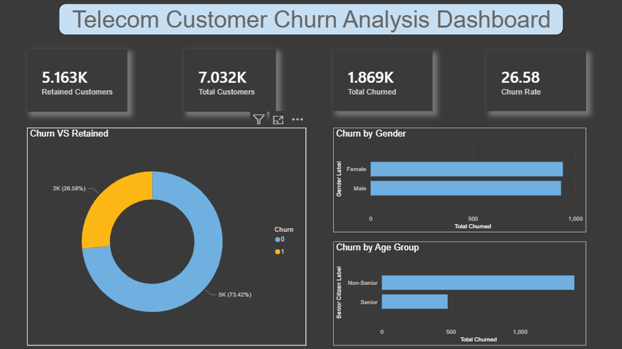
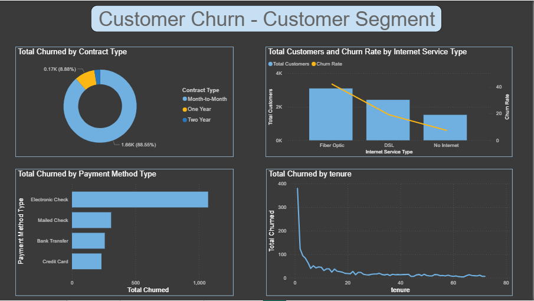
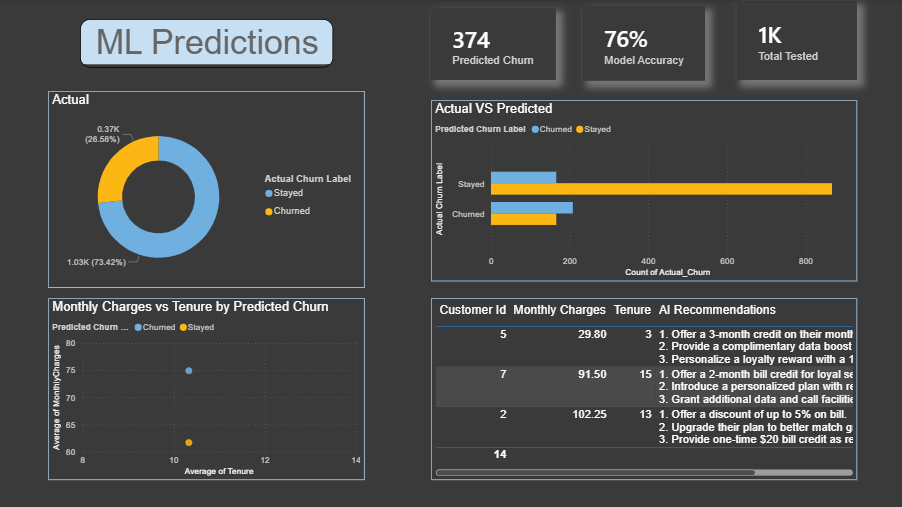

# 📊 Customer Churn Prediction & Analysis | Telecom

## 📌 About the Project
An end-to-end data analytics and machine learning project that predicts 
telecom customer churn, identifies high-risk segments, and generates 
AI-powered retention strategies to reduce customer loss.

## 🛠️ Tech Stack
| Tool | Purpose |
|---|---|
| Python (Pandas, Scikit-learn, SMOTE) | Data cleaning, EDA, ML modeling |
| MySQL | Business analytical queries |
| Power BI | Interactive dashboard |
| Groq AI (LLaMA 3.1) | AI retention recommendations |
| SQLAlchemy | Python to MySQL integration |

## 📂 Data Source
- **Dataset:** IBM Telco Customer Churn Dataset
- **Source:** [Kaggle](https://www.kaggle.com/datasets/blastchar/telco-customer-churn)
- **Size:** 7,032 customers | 20 features

## ✨ Features & Highlights
- Performed EDA and data cleaning on 7,032 customer records
- Built Random Forest model with **76% accuracy** using SMOTE for class imbalance
- Wrote **12+ MySQL queries** for business segmentation analysis
- Identified **374 high-risk customers** predicted to churn
- Integrated **Groq AI (LLaMA 3.1)** to auto-generate personalized retention strategies
- Built interactive **3-page Power BI dashboard** with 10+ visualizations

## 💡 Business Impact & Insights
- Overall churn rate: **26.58%** — 1 in 4 customers leaving
- **Month-to-Month** contract customers churn the most
- **Fiber Optic** users show highest churn among internet service types
- **Electronic Check** payment users churn at **45%**
- Churned customers pay **$74/month** vs **$61/month** for retained customers
- **Senior citizens** churn at **42%** — highest risk demographic
- Customers in first year (**0-1 Year tenure**) are most likely to leave

## 🔑 API Setup
This project uses Groq AI API for retention recommendations.
Create your free API key at [https://console.groq.com](https://console.groq.com)
and replace `YOUR_API_KEY_HERE` in the notebook.

## 📸 Screenshots & Demo
> Add screenshots of your Power BI dashboard here

## 👤 Author
**Your Name**
[LinkedIn](#) | [GitHub](#)
